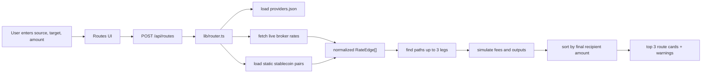
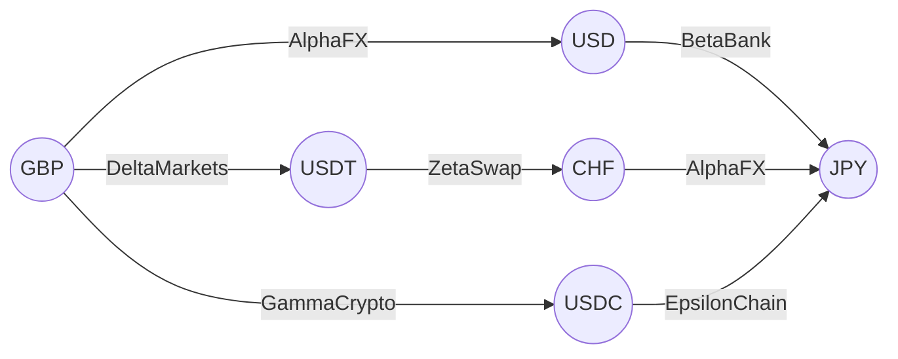
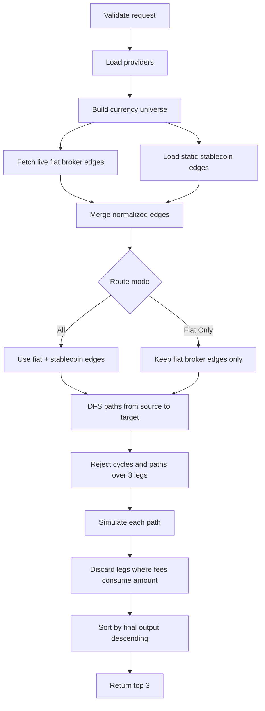
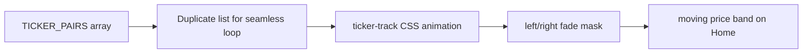
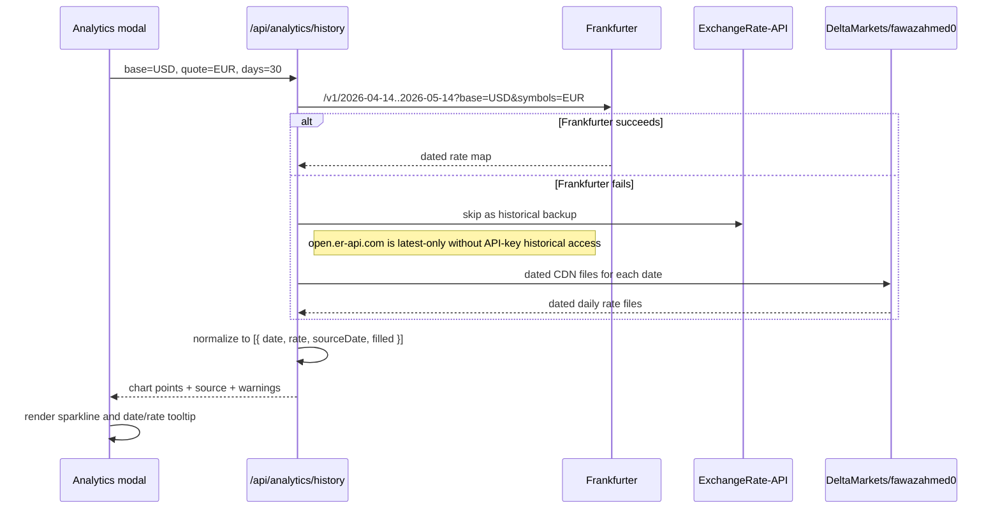

# Multi-Leg FX Router

A Vercel-ready TypeScript web app for finding the top 3 highest-output FX/payment routes between a source currency, target currency, and amount. The router supports paths with up to 3 legs, mixes fiat brokers and stablecoin venues when allowed, applies every provider fee per leg, and keeps returning useful routes when one live provider fails.

## Table Of Contents

- [Architecture](#architecture)
- [Website Features](#website-features)
- [Providers, APIs, And Normalization](#providers-apis-and-normalization)
- [Detailed Architecture Modeling](#detailed-architecture-modeling)
- [Deployment](#deployment)
- [Testing](#testing)
- [AI Tools Used](#ai-tools-used)
- [One Thing The AI Got Wrong](#one-thing-the-ai-got-wrong)
- [What I Would Do Differently With More Time](#what-i-would-do-differently-with-more-time)

## Architecture

### Stack Used

- **Next.js App Router** for pages and server API routes.
- **TypeScript** across the app, routing engine, API handlers, and tests.
- **React** for interactive route search, route cards, analytics modals, and chart tooltips.
- **Tailwind CSS** for UI styling.
- **Vercel-compatible API routes** for server-side routing and analytics history fetching.
- **Vitest** for unit tests.
- **No database**. Provider config lives in `data/providers.json`.
- **No API keys or environment variables**. All live providers use public no-key endpoints.

### Deployment Type

The app is designed for **Vercel**:

- Static pages are prerendered where possible.
- `POST /api/routes` runs server-side on demand.
- `GET /api/analytics/history` runs server-side on demand.
- Live API calls use `fetch`, `AbortController`, and short in-memory caching.
- There are no long-running background processes.

### Important Files

```text
app/
  page.tsx                         Home page and top moving price band
  routes/page.tsx                  Main route search page
  analytics/page.tsx               Pair analytics page and historical chart modal
  api/routes/route.ts              POST route calculation endpoint
  api/analytics/history/route.ts   GET historical chart data endpoint

components/
  RouteForm.tsx                    Search form and route filter controls
  RouteResults.tsx                 Loading/error/warning/result states
  RouteCard.tsx                    Ranked route cards
  LegBreakdown.tsx                 Per-leg execution details

lib/
  providers.ts                     Provider config loading and static edge creation
  rates.ts                         Live provider fetchers and normalization
  graph.ts                         Directed graph path discovery
  fees.ts                          Per-leg fee and output calculation
  router.ts                        Request validation, simulation, ranking
  formatting.ts                    Currency, amount, rate formatting helpers

data/
  providers.json                   Six provider definitions and static pairs

tests/
  router.test.ts                   Routing and fee tests
  formatting.test.ts               Amount formatting tests
```

### High-Level Request Flow



## Website Features

### Home

- Landing page for the product.
- Top moving price band with common FX/stablecoin pairs.
- Quick search widget that navigates into the route search page.
- Navigation links for `Home`, `Routes`, and `Analytics`.

### Routes

- Inputs for source currency, target currency, and source amount.
- Amount input formats while typing and shows the source currency symbol.
- Route mode switch:
  - **All**: fiat broker plus stablecoin venue routes.
  - **Fiat Only**: only fiat broker routes.
- Search button and estimated receive preview.
- Top 3 routes ranked by final recipient amount, highest first.
- Route cards show:
  - rank
  - final recipient amount
  - path with provider per leg
  - direct-route difference when a direct route exists
  - badges for fiat/stablecoin route types
  - total fees by fee currency
  - provider warnings when live APIs fail
  - per-leg execution detail table

### Analytics

- Fiat and crypto/stablecoin pair analytics views.
- Pair cards with current quote, recent change, and chart entry point.
- Chart modal with `7D`, `30D`, `90D`, and `1Y` periods.
- Fiat charts pull dated daily API data.
- Chart tooltip shows rate and date inline, for example `0.85361 Thu, May 14`.
- Tooltip anchors to the chart edge so it does not cover high points.
- Historical chart endpoint has a provider fallback chain.

## Providers, APIs, And Normalization

Provider definitions are stored in `data/providers.json`. Every provider has:

- `name`
- `type`
- `rate_source`
- `fee_model`
- optional `endpoint`
- optional `supported_currencies`
- optional `static_pairs`

### Provider List

| Provider | Type | Rate Source | Fee Model |
| --- | --- | --- | --- |
| AlphaFX | fiat broker | Frankfurter live API | `0.0015` percent, `0` flat |
| BetaBank | fiat broker | ExchangeRate-API open endpoint | `0.0008` percent, `25` flat |
| DeltaMarkets | fiat broker | fawazahmed0 currency API | `0.0011` percent, `5` flat |
| GammaCrypto | stablecoin venue | static directed pairs | `0.0010` percent, `1` flat |
| EpsilonChain | stablecoin venue | static directed pairs | `0.0012` percent, `2` flat |
| ZetaSwap | stablecoin venue | static directed pairs | `0.0025` percent, `0` flat |

All fees are charged in the source currency of the leg.

### Live APIs Used For Routing

#### AlphaFX - Frankfurter

Example:

```http
GET https://api.frankfurter.dev/v1/latest?base=GBP
```

Typical shape:

```json
{
  "amount": 1,
  "base": "GBP",
  "date": "2026-05-14",
  "rates": {
    "USD": 1.33,
    "EUR": 1.17
  }
}
```

Normalization:

- Use request base as `from`.
- Each `rates` entry becomes one directed edge: `GBP -> USD`, `GBP -> EUR`, etc.
- Currency codes are normalized to uppercase.

#### BetaBank - ExchangeRate-API Open Endpoint

Example:

```http
GET https://open.er-api.com/v6/latest/GBP
```

Possible shapes:

```json
{
  "result": "success",
  "base_code": "GBP",
  "rates": {
    "USD": 1.33
  }
}
```

or:

```json
{
  "result": "success",
  "base_code": "GBP",
  "conversion_rates": {
    "USD": 1.33
  }
}
```

Normalization:

- Accept either `rates` or `conversion_rates`.
- Reject non-success responses when `result` is present.
- Convert each valid quote into a directed `RateEdge`.

#### DeltaMarkets - fawazahmed0 Currency API

Example:

```http
GET https://cdn.jsdelivr.net/npm/@fawazahmed0/currency-api@latest/v1/currencies/gbp.json
```

Typical shape:

```json
{
  "date": "2026-05-14",
  "gbp": {
    "usd": 1.33,
    "eur": 1.17
  }
}
```

Normalization:

- Lowercase response keys are converted to uppercase internally.
- The nested base map is converted into directed `RateEdge` objects.

### Static Stablecoin Providers

GammaCrypto, EpsilonChain, and ZetaSwap use `static_pairs` in `providers.json`.

Important modeling choice:

- Static pairs are **directed**.
- The router does **not** infer reverse rates.
- If `USDT -> JPY` exists but `JPY -> USDT` does not, only `USDT -> JPY` is available.

### RateEdge Normalization

All live and static quotes are normalized into the same internal shape:

```ts
type RateEdge = {
  from: string;
  to: string;
  provider: string;
  providerType: "fiat_broker" | "stablecoin_venue";
  rateSource: "frankfurter" | "exchange_rate_api" | "fawazahmed0" | "static";
  rate: number;
  feePercent: number;
  feeFlat: number;
  feeCurrency: string;
};
```

This lets the graph and fee simulation treat all providers uniformly.

### Failure Handling

The live provider fetch layer is defensive:

- Uses `AbortController` timeouts.
- Uses `Promise.allSettled` so one provider failure does not fail the whole request.
- Validates response shape before creating edges.
- Filters missing, invalid, non-finite, zero, and negative rates.
- Returns provider warnings in the API response.
- Caches live responses briefly in memory to reduce repeated calls during local testing.

## Detailed Architecture Modeling

### Route Search Model

Currencies are graph nodes. Provider quotes are directed graph edges.

Example graph:



The router does not choose routes by best individual rate. It enumerates candidate paths and simulates the actual money movement through every leg.



### Fee Simulation

For each leg:

```text
total_fee = leg_amount * fee_percent + fee_flat
post_fee_amount = leg_amount - total_fee
leg_output = post_fee_amount * rate
```

If `post_fee_amount <= 0`, the leg is invalid and the whole route is discarded.

Flat fees matter because the best route can change by amount size. A route with a low percent fee and high flat fee might be bad for a small amount but strong for a large amount.

### Fiat And Crypto Route Behavior

**All mode**

- Includes fiat broker live edges.
- Includes stablecoin static edges.
- Can produce mixed routes such as:

```text
GBP -> [DeltaMarkets] -> USDT -> [ZetaSwap] -> CHF -> [AlphaFX] -> JPY
```

**Fiat Only mode**

- Filters out stablecoin venue edges.
- Allows only providers where `providerType === "fiat_broker"`.
- Can still produce multi-leg fiat paths such as:

```text
GBP -> [AlphaFX] -> CHF -> [AlphaFX] -> JPY
```

### Top Moving Price Band

The home page includes a lightweight scrolling price band for visual context.



Implementation notes:

- The ticker is UI-only market context, not used in route ranking.
- Pairs are duplicated so the animation can loop continuously.
- CSS masks and faded borders make the band blend into the page.

### Chart Data Model

Fiat analytics charts pull dated historical points through `GET /api/analytics/history`.

Example 30-day request:

```http
GET /api/analytics/history?base=USD&quote=EUR&days=30
```

If today is May 14, the API requests the calendar range from Apr 14 through May 14. The endpoint returns one chart point per calendar day.



Chart normalization:

- Dates are returned as ISO strings.
- Rates are numeric.
- Missing calendar days, such as weekends or not-yet-published current-day data, carry forward the latest available market rate.
- Each point includes:

```ts
type HistoricalPoint = {
  date: string;
  rate: number;
  sourceDate: string;
  filled: boolean;
};
```

Tooltip behavior:

- The cursor snaps to the nearest chart point.
- The label shows rate and date inline.
- The label appears on the upper chart bound by default.
- If the hovered point is high, the label moves to the lower chart bound to avoid covering the line.

## Deployment

### Run Locally

```bash
npm install
npm run dev
```

Open:

```text
http://localhost:3000
```

Useful local checks:

```bash
npm test
npm run build
```

### Deploy To Vercel

1. Push the repository to GitHub.
2. Import the GitHub repository into Vercel.
3. Use the default Next.js settings.
4. Deploy.

No database, secrets, API keys, or environment variables are required.

## Testing

The current test suite covers:

- percent plus flat fee calculation
- small trades invalidated by flat fees
- static multi-leg route discovery
- max 3 legs
- no cycles
- ranking by simulated final output instead of raw rate alone
- amount input formatting

Run tests:

```bash
npm test
```

Run production build:

```bash
npm run build
```

## AI Tools Used

I used OpenAI Codex as an implementation partner to scaffold the Next.js project, build the routing engine, create the API routes, develop the UI, and add tests. I used it iteratively: first for the core graph and fee model, then for provider integration, then for UI polish and analytics chart behavior.

The important human decisions were the routing model and failure behavior: enumerate and simulate every valid route instead of using a naive shortest-path algorithm, keep provider failures isolated, and show fees by currency rather than inventing a misleading single total.

## One Thing The AI Got Wrong

The easy mistake was treating provider fees as one total number. That is wrong because later-leg fees can be charged in intermediate currencies like USD, USDT, or CHF. I caught it while reviewing multi-leg route outputs where fees came from different leg source currencies; adding them directly would have implied they were all in GBP. The implementation now returns `totalFeesByCurrency` and the UI shows exact per-leg fees.

## What I Would Do Differently With More Time

I would add richer quote freshness and observability: provider latency, cache age, per-base success rates, and a small debug panel for which providers contributed each returned route. That would make operational review easier without changing the routing model.
